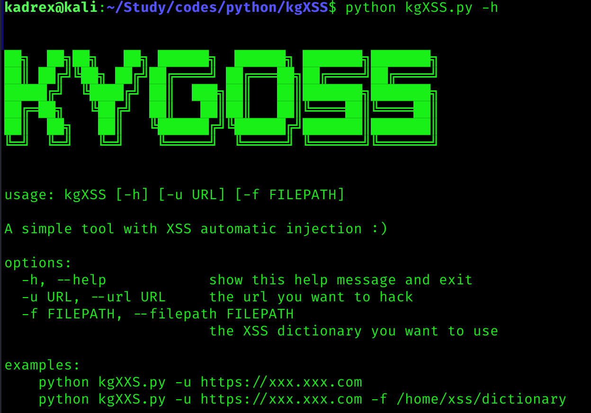
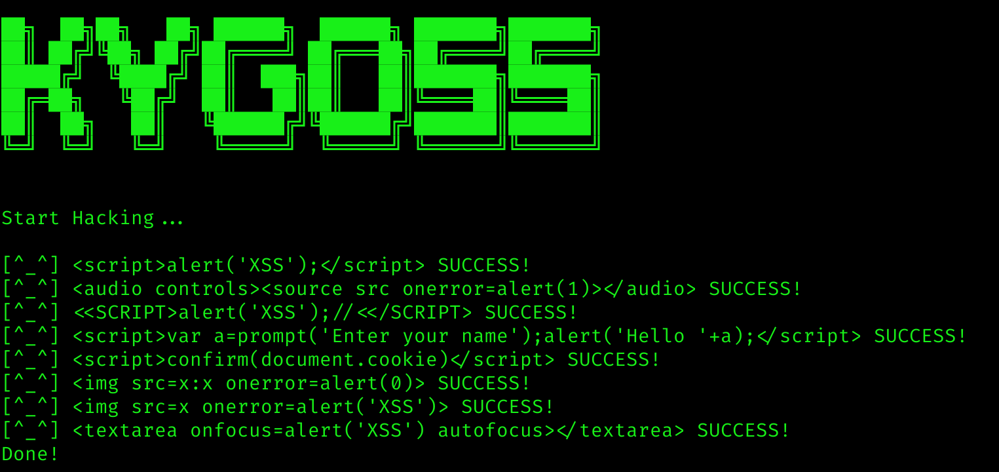

# 前言
  
  
自己弄了个xss注入自动化工具玩玩。这个工具针对的是输入栏，它会自动捕获第一个输入栏，然后遍历XSS注入字典，如果触发alert，则停止注入并输出信息。  
 
# 示例
  
  
# 技术回顾
- 线程池：设定了最大线程为50的线程池。线程池会在任务开始之前新建好50个线程，每当一个线程执行完，线程池中的线程不会关闭，而是让下一个新线程继续使用线程池中创建好的线程。这样的优势在于不用重复打开和关闭线程，缺点在于如果线程数量较少则浪费资源（比如只有5个线程）    
- 队列(Queue):队列是线程安全的，这意味着队列中的值会按照线程的顺序来拿取和填入，而不用担心竞争问题。  
- selenium库的webdriver:这是本次主要依赖的库，webdriver会完全模拟可视化的打开浏览器然后执行各种操作，我将浏览器设置为无头模式以在后台运行。  
- 捕获alert:我原本打算使用lxml库（或BeautifulSoup库）来完成本次的脚本，但发现在捕获alert探窗时出现了些许错误，而selenium库中的`selenium.webdriver.support.expected_conditions.alert_is_present()`函数可以轻松完成这一点。另外，`WebDriverWait`函数也明显比`time.sleep`更灵活（每500ms检查一次，符合条件则结束计时，而不是一定等待多少秒）  
